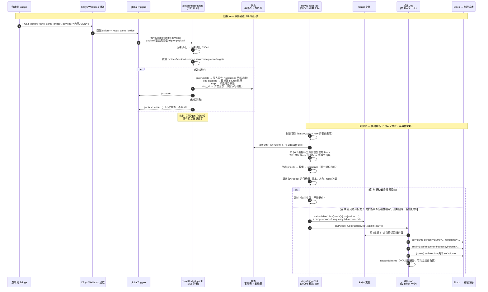

# 接收端架构与数据流（Webhook → Block 输出）

> 本文描述**从游戏侧 POST Webhook 开始，到 XToys 的 Block 真的写出为止**的完整链路。
>
> 阅读顺序建议：先看 §1 的角色图建立心智模型，再看 §2 的时序图逐跳对照。
> 每个步骤都标了对应代码函数与文档章节，方便实现时逐条核对。
>
> 依赖文档：`docs/01-xtoys-script-format.md`（JSON 语法与宿主 API）、
> `docs/02-webhook-protocol.md`（协议字段）、`docs/03-protocol-mapping.md`（part→Block 映射与仲裁）。

最后更新：2026-09-30（映射定论后，实现前）

---

## 1. 角色与边界

```
┌─────────────┐   POST https://webhook.xtoys.app/<ID>    ┌──────────────────────────────┐
│  游戏侧      │ ───────────────────────────────────────► │        XToys 平台             │
│  Bridge 插件 │   body: {"action":"xtoys_game_bridge",   │  ┌────────────────────────┐  │
│             │          "payload":"<内层JSON字符串>"}    │  │  Script（本项目）        │  │
│ 只知道:      │                                          │  │  ├ globalTriggers       │  │
│  部位+强度   │                                          │  │  ├ customFunctions(ES5) │  │
│  频率+旋转   │                                          │  │  ├ jobs (1调度 + N输出)  │  │
│             │                                          │  │  ├ channels (N个 Block)  │  │
└─────────────┘                                          │  ├ initialActions        │  │
   ▲ §3.5：游戏侧代码里                                       │  ├ finalActions          │  │
     不出现设备/通道/Job 名                                    │  └ Script 变量（数据总线）│  │
                                                          │  └───────────┬────────────┘  │
                                                          │              │ 用户手工在 UI  │
                                                          │              ▼ 绑定一次       │
                                                          │     物理设备 / 子通道         │
                                                          └──────────────────────────────┘
```

**关键边界**（`HANDOFF.md` §3）：

- 游戏侧只发**逻辑意图**，不知道你接了几台设备。
- 映射表（part → Block）**完全住在接收端配置里**。
- **Script 停止 ≠ 设备归零的唯一保障**：Final Actions 的显式 UI 归零才是（§7）。
- **同步返回 ≠ 设备确认**（§3.4）：`setVariable` / `callAction` 不抛异常只说明 JS 调用成功。

**本阶段规模**（映射定论）：9 个 Block = `nipple` / `clitoris` / `vagina` / `anus`
× (`estim` + `vibrate`)，另加旋转样板 `Rotate-nipple`。

---

## 2. 主链路时序图



---

## 3. 逐跳说明（对照实现用）

### 阶段 A — 事件到达

| 跳 | 做什么 | 对应实现 | 依据 |
| --- | --- | --- | --- |
| A1 | Webhook POST 落到 XToys 的 `webhook` 通道 | `channels["webhook-a"]` | 语法 §2 |
| A2 | `globalTriggers` 用外层 `action == xtoys_game_bridge` 匹配 | `globalTriggers[0]` | 语法 §5 |
| A3 | 把载荷交给 JS：`variables[].value = "trigger-payload"`（魔法值） | `customCode.xtoysBridgeHandle(payload)` | 语法 §4.4 |
| A3.5 | ⚠️ **真机实测：注入的载荷已剥掉外层封装**，直接就是内层协议对象 | `xthbNormalizeEnvelope` 两种形状都认 | 语法 §4.4 |
| A4 | 认出协议对象（外层封装 / 内层对象 / 双重编码字符串 / 直接对象） | `xthbNormalizeEnvelope` | 协议 §1 |
| A5 | 解析并校验：`protocolVersion` / `command` / `source` / `sequence` / `targets`<br/>含 §6.2 指标规则、§6.5 同部位重复拒绝 | `xthbParseCommand` / `xthbParseTargets` | 映射 §6.2 / §6.5 |
| A6 | 落状态：`play`/`update` 写事件、`set_baseline` 换快照、`stop` 选择器移除、`stop_all` 清空 | `xthbApplyPlay` / `ApplyBaseline` / `ApplyStop` | 协议 §5 |
| A7 | 返回 `{ok:true}` 或 `{ok:false, code}` | 执行阶段错误也必须归一化成 `{ok:false}` | 状态文档 §2 |

**这一阶段结束时没有任何输出被改变。** 事件只是被记进内存状态。
这个"事件与输出解耦"是整个设计的核心：事件可以在任意时刻到达、任意密，
输出永远由 100 ms 的 tick 统一计算 —— 这也是 `HANDOFF.md` §6 说"攻击极密必须做批量合并"
在接收端的等价物（合并天然发生）。

### 阶段 B — 输出刷新（每 100 ms）

| 跳 | 做什么 | 对应实现 | 依据 |
| --- | --- | --- | --- |
| B1 | 100 ms 自循环调度 Job 调 tick | `jobs["xthb-scheduler"]`（timer 0.1 + `goTo` 自循环） | 语法 §3 |
| B2 | 到期清理 | `xtoysBridgeTick` | 协议 §3 |
| B3 | 收集该部位的候选：基线意图 ∪ 未到期事件意图（只保留带该 metric 的） | `xthbCollectCandidates(part, metric)` | 映射 §4.1 |
| B4 | 按 §6.2 把三条指标分派到对应的 Block；没配 Block 的指标忽略并留痕 | `xthbChannelMapFor` / 留痕计数 | 映射 §6.2 |
| B5 | 仲裁：`priority` → 数值 → `sequence`（**只在同一部位内部**） | `xthbPickBetter` | 映射 §4.2 / §5 |
| B6 | 算目标值 / 频率 / 方向码 / ramp 秒数（winner 决定全部字段） | `xthbComputeOutputs` / `xthbChannelOutput` / `xthbRampSeconds` | 映射 §4.3 |
| B7 | **值 `或` 驱动者身份（source+eventId+sequence）变化** → 推送；两者都不变 → 跳过 | `xthbPushOutputs` 的比较 | 映射 §4.4 |
| B8 | `setVariable` 写输出变量 | `xthbPushOutputs` | 语法 §6 |
| B9 | `callAction({type:"updateJob", action:"start"})` 唤醒输出 Job | `xthbPushOutputs` | 语法 §4.3 |
| B10 | 输出 Job 用 `{变量名}` 读值并写硬件 | `jobs["xthb-output-{metric}-{part}"]` | 语法 §3/§4.2 |
| B11 | 输出 Job 立刻停自己（一次性刷新器） | 输出 Job 最后一条 Action | 语法 §3 |

**为什么要有"写变量 + 启动 Job"这一步**：这是 `docs/01-xtoys-script-format.md` §6 记录的
**唯一实测可用的路径** —— JS 不能直接操作硬件，只能写 Script 变量，再由 Job 的
`{变量名}` 占位符读走。所以 JS 算完结果必须经过变量这个数据总线。

**B7 为什么不能只比数值**：只比数值会让"新事件、强度恰好与当前相同"被静默丢掉 ——
调用方拿到 `{ok:true}`，体感上却什么都没发生；而且 ramping 是**设备级动作**，
重跑一次输出 Job 才会重新走一遍 `rampTime`，这正是连击需要的重触发感。
所以判据是 **值 或 驱动者身份** 变化。完整规则与行为对照表见
`docs/03-protocol-mapping.md` §4.4。

**旋转的顺序约束**（`HANDOFF.md` §4.3）：输出 Job 里两个 `setDirection`
必须排在 `setVolume` **之前**，否则换向会慢一拍。见 §5。

### 阶段 C — 停止与归零

| 触发 | 做什么 | 对应实现 |
| --- | --- | --- |
| 收到 `stop_all` | 清空全部基线与事件（**保留每个 source 的基线序号栅栏**）→ 立即写零并推给输出 Job | `xthbExecute` 的 `stop_all` 分支 |
| 用户手动停 Script | `finalActions`：停调度 Job → **显式 UI 归零每个 Block 的音量** → 停所有输出 Job → 最后跑 JS 清理 | `finalActions` |
| JS 抛错 / 运行时未初始化 | 上面的**显式 UI 归零 Action 仍然执行** —— 它排在 `customCode` **之前**，所以不依赖 JS 是否成功 | 语法 §7 |

**这三条是并列的**，不是二选一：JS 侧归零负责变量与状态，Final Actions 的 UI Action
负责在 JS 已经坏掉时仍然把硬件写到零。

> ⚠️ **顺序很重要（2026-09-30 修正）：字面量归零必须排在 `customCode` 之前。**
> 早期版本把 `xtoysBridgeStopAll()` 放在 Final Actions 第 1 条，等于把唯一的硬件硬保障
> 押在"JS 不抛错"上。现在生成器有自检强制这个顺序。
>
> ⚠️ **`stop_all` 是唯一在 `handle` 里直接推输出的路径**（安全例外）：
> 它必须在同一个调用内把归零推出去，不能等下一个 tick。
> 宿主 API 调用全部包在 try/catch 里，所以某一个通道失败不会中断其余通道的归零。

> ⚠️ **归零 = 归零音量，不包括频率。** `frequency` 是 E-Stim 的调制设置而非刺激量，
> 缺省语义是"保持设备当前值"。所以 Initial / Final Actions 都**不**写频率，
> 输出 Job 里的 `setFrequency` 也必须由"本次是否有频率意图"门控。
> 见 `docs/03-protocol-mapping.md` §4.5 与 `docs/01-xtoys-script-format.md` §7。

---

## 4. 状态模型

tick 计算所需的最小状态（`HANDOFF.md` §7.2：只有这三样）：

```
xthbEvents      : { "<source>\u0000<eventId>" → { source, eventId, sequence, parts, finishAtMs } }
                  parts = { <part> → 意图 }   意图 = { estimIntensity?, vibrateIntensity?, frequency?, rotateSpeed?, rotateDirection?, priority? }
                  身份 = source+eventId；只有严格更大的 sequence 才替换整个目标集

xthbBaselines   : { <source> → { sequence, parts } }   基线是【完整快照】，不是叠加
xthbBaselineSeq : { <source> → number }                序号栅栏；stop_all 清状态但【保留】它

xthbWritten     : { <channel> → { value, frequency, rampSeconds, driveId } }
                  上次写进变量的输出 + 当时的【驱动者身份】
                  driveId = source + "\0" + eventId + "\0" + sequence（无候选时 ""）
                  推送条件 = 数值 或 driveId 变了（见 §3 B7 与映射 §4.4）
```

输出变量（每条 Block 一组，命名见 `docs/03-protocol-mapping.md` §2.1）：

| 变量 | 用途 | 谁读 |
| --- | --- | --- |
| `xthb-{metric}-{part}-value` | 目标值 0–100 | `setVolume.percentVolume` |
| `xthb-{metric}-{part}-ramp-seconds` | 渐变秒数 | `setVolume.rampTime` |
| `xthb-estim-{part}-frequency` | 频率 0–100；**哨兵值 `""` = 本次不驱动频率** | `setFrequency.frequencyPercent`（带 `requiredExpression` 门控） |
| `xthb-rotate-{part}-direction-code` | `1` 顺 / `-1` 逆 / `0` 无 | `setDirection.requiredExpression` |

> ⚠️ `rampTime` 单位是**秒**这一条在 `docs/01-xtoys-script-format.md` §4.2 仍标 ⚠️未独立验证，
> 真机验收时要专门验一次（`HANDOFF.md` §9.1）。
>
> ⚠️ 频率变量的哨兵值形式（`""` 还是别的）待实现时定；要点是必须能把
> "没有频率意图"与"频率 = 0"区分开，见 `docs/03-protocol-mapping.md` §4.5。

---

## 5. 输出 Job 的内部顺序

每个 Block 一个输出 Job，被唤醒后顺序执行、最后停自己：

```
① 旋转槽专属：setDirection(clockwise)        requiredExpression: {direction-code} == 1
② 旋转槽专属：setDirection(counterclockwise) requiredExpression: {direction-code} == -1
   ↑ 方向必须排在速度之前，否则换向慢一拍（HANDOFF §4.3）
③ setVolume  rampTime={ramp-seconds}  percentVolume={value}
④ E-Stim 专属：setFrequency format=relative frequencyPercent={frequency}
   ↑ 【条件动作】只有本次有频率意图才发。频率缺省 = 保持设备当前值，不是置零
     （必须用 requiredExpression 门控，见映射 §4.5）
⑤ updateJob stop（停自己）
```

- 强度槽与振动槽不需要 ① ② ④，只有 ③ ⑤。
- `requiredExpression` 为假的 Action 不生效，所以两个方向 Action 可以并列放着；
  ④ 的频率门控也用同一机制。
- **未使用的 Job 也应保留**（步骤里只放"停自己"），且不接任何设备（语法 §3）。

---

## 6. 错误与失败路径

| 情况 | 行为 | 依据 |
| --- | --- | --- |
| 外层 `action` 不匹配 | 不触发，静默 | 语法 §5 |
| 内层 JSON 非法 / 字段非法 | 返回 `{ok:false, code}`；**不改状态、不驱动输出** | 协议 §6 |
| `part` 不是非空字符串 | 整体拒绝（字段本身畸形） | 映射 §6.1 |
| `part` 是字符串但不在映射配置里 | **忽略并留痕**（与"没配 Block"同一条路径） | 映射 §6.1 |
| 部位合法但没配该类 Block | **忽略并留痕**（计数 + 最近一次 part/指标 + 日志） | 映射 §6.2 |
| 同一 `targets` 里同部位重复 | 整体拒绝（数组语法错误，不是部位合法性问题） | 映射 §6.5 |
| `sequence` 未严格递增 | 被忽略（**缺陷 1 要修**：必须如实返回失败） | 协议 §2 |
| JS 抛错 | `try/catch` 记一条日志即可（§7.3：不做每槽独立异常隔离） | §7.3 |
| Script 停止 / JS 已坏 | Final Actions 的显式 UI 归零兜底 | 语法 §7 |

> **没有"协议部位白名单"。** 部位名是否可用完全由接收端映射配置定义，
> 未识别与未配 Block 走同一条"忽略并留痕"路径。见 `docs/03-protocol-mapping.md` §6.1。

---

## 7. 一次完整请求的例子

游戏侧 POST：

```json
{
  "action": "xtoys_game_bridge",
  "payload": "{\"protocolVersion\":1,\"command\":\"play\",\"source\":\"repetition\",\"eventId\":\"hit-0042\",\"sequence\":17,\"targets\":[{\"part\":\"nipple\",\"estimIntensity\":65,\"vibrateIntensity\":30,\"frequency\":40,\"rotateSpeed\":50,\"rotateDirection\":\"clockwise\",\"durationMs\":900,\"rampUpMs\":120,\"rampDownMs\":180,\"priority\":10}]}"
}
```

链路：

1. Trigger 取出 `payload` 字符串 → `xtoysBridgeHandle` 解析外层与内层。
2. 校验通过 → 事件表写入 `repetition\u0000hit-0042`，`finishAtMs = now + 900`。
3. 下一个 tick（≤100 ms 后）：
   - `nipple` 有 3 个 Block：`Estim-nipple` / `Vibrate-nipple` / `Rotate-nipple`。
   - 各指标分派：`estimIntensity=65` → `Estim-nipple`，`vibrateIntensity=30` → `Vibrate-nipple`，
     `frequency=40` → `Estim-nipple`，`rotateSpeed=50` + 方向 → `Rotate-nipple`。
   - 仲裁（与其他来源/基线比 priority/数值/sequence）后得出各自的值。
4. 值有变化 → 写 7 个输出变量 → 启动 3 个输出 Job。
5. 三个输出 Job 各自写硬件后停自己：
   - `Estim-nipple`：`setVolume 65` + `setFrequency 40`
   - `Vibrate-nipple`：`setVolume 30`
   - `Rotate-nipple`：`setDirection clockwise` → `setVolume 50`
6. 900 ms 后该事件被 tick 清掉；若该 `nipple` 有基线则回落到基线值，否则归零。

---

## 8. 实现要点清单（动代码时逐条对照）

- [ ] 事件驱动与输出刷新**彻底分离**：`handle` 永不直接写硬件，只改状态。
- [ ] `part` 是唯一执行定位键；协议与代码里都不出现设备名。
- [ ] **没有部位白名单**：部位名是否可用由映射配置决定，未识别与未配 Block 走同一条忽略路径。
- [ ] 一个 Block 专属一个 part，配置校验里硬性检查（配重则拒绝初始化）。
- [ ] 三条指标各自独立分派，没有主次/门控。
- [ ] 仲裁只在同一部位内部：`priority` → 数值 → `sequence`。
- [ ] `frequency` 跟随强度 winner，不独立仲裁。
- [ ] 推送条件 = **数值 或 驱动者身份（driveId）** 变化；稳定态仍然跳过。
- [ ] **频率缺省 ≠ 0**：缺省 = 保持设备当前值，输出 Job 的 `setFrequency` 必须被门控。
- [ ] Initial / Final Actions **不写频率**（归零的是音量）。
- [ ] 旋转 Job 里两个 `setDirection` 排在 `setVolume` 之前。
- [ ] `stop_all`、JS 归零函数、Final Actions 显式 UI 归零 —— 三条都要有。
- [ ] 绝不调用任何设置最大强度/最大旋转速度的接口。
- [ ] 日志与变量措辞遵守 §3.4，不得声称设备已确认。
